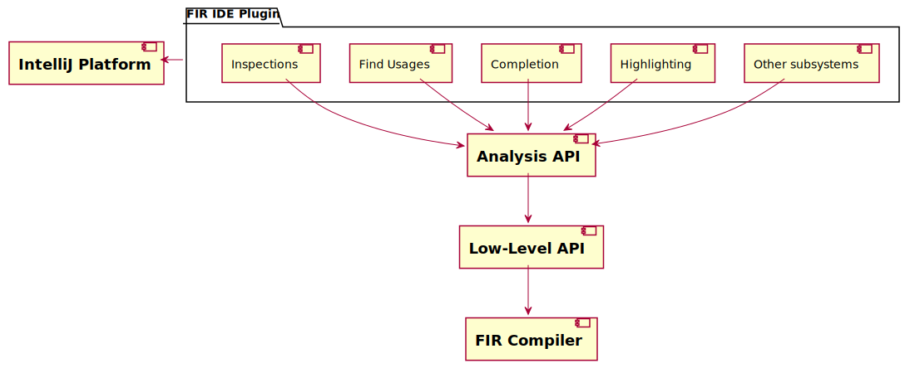

# General FIR IDE Architecture

The plugin has a layer architecture and consists of 4 layers, where layers **N** depends on layer **N-1** and there are no other dependencies between the layers:

1. **FIR Compiler** Frontend.  [Read more about FIR](https://github.com/JetBrains/kotlin/blob/master/docs/fir/fir-basics.md).
2. **Low-level API Layer**. The interlayer between **Analysis API** & **FIR** Mostly responsible for **KtElement → FirElement** mapping, lazy resolving of FIR Declarations, and diagnostics collecting.[Read more about Low-Level API](https://github.com/JetBrains/kotlin/blob/master/docs/analysis-api/low-level-api-fir.md).

3. **Analysis API Layer**. The public API allows the Kotlin IDEA FIR plugin to interact with the compiler. The API surface is Kotlin frontend agnostic, and it can work via both Kotlin frontends FIR and FE1.0. [Read more about Analysis API](https://github.com/JetBrains/kotlin/blob/master/docs/analysis-api/analysis-api.md).

4. **Plugin Subsystems layer**. The layer where the actual plugin is. All subsystems (completion/highlighting/find usages) live here. It does not interact directly with the Kotlin compiler(and corresponding modules do not have dependencies on compiler modules). To get Kotlin resolve information, it uses **Analysis API**.